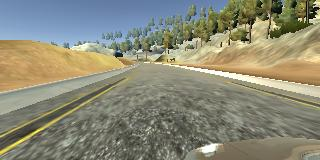
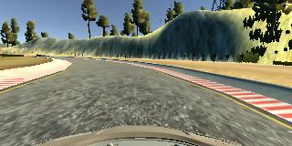
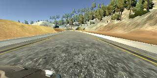

# Behaviorial Cloning Project

[](http://www.udacity.com/drive)


The goals / steps of this project are the following:
* Use the simulator to collect data of good driving behavior
* Build, a convolution neural network in Keras that predicts steering angles from images
* Train and validate the model with a training and validation set
* Test that the model successfully drives around track one without leaving the road
* Summarize the results with a written report

left view:  
  
center view:  
  
right view:  


## Rubric Points
### Here I will consider the [rubric points](https://review.udacity.com/#!/rubrics/432/view) individually and describe how I addressed each point in my implementation.  

---
### Files Submitted & Code Quality

#### 1. Submission includes all required files and can be used to run the simulator in autonomous mode

My project includes the following files:
* model.py containing the script to create and train the model
* drive.py for driving the car in autonomous mode
* model.h5 containing a trained convolution neural network 
* readme.md summarizing the results

#### 2. Submission includes functional code
Using the Udacity provided simulator and my drive.py file, the car can be driven autonomously around the track by executing 
```sh
python drive.py models/model.h5
```

#### 3. Submission code is usable and readable

The model.py file contains the code for training and saving the convolution neural network. The file shows the pipeline I used for training and validating the model, and it contains comments to explain how the code works.

### Model Architecture and Training Strategy

#### 1. An appropriate model architecture has been employed

My model consists of the NVIDIA self-driving car network, as outlined [here](https://devblogs.nvidia.com/parallelforall/deep-learning-self-driving-cars/). This consists of a lambda layer to normalize the data, cropping out excess pixels consisting of horizon and the hood, and then 4 convolution layers, a dropout layer, a flatten layer, and then four fully connected layers.

#### 2. Attempts to reduce overfitting in the model

The model contains a dropout layer to avoid overfitting (clone line 70).

#### 3. Model parameter tuning

The model used an adam optimizer, so the learning rate was not tuned manually (clone.py line 78).

#### 4. Appropriate training data

The training data consists of driving both forward and backwards on the track for multiple laps, with the driving captured by using a joystick for better control and smoother data.

### Model Architecture and Training Strategy

#### 1. Solution Design Approach

I began by building a basic network in accordance to the Udacity lectures. This was built on LeNet with only basic training data. This did alright but wasn't correcting itself well and when there was a change in scenery would veer off the road.

I next added the multiple views and then switched to the NVIDIA architecture per recommendations. This worked a lot better but I was still going off the road. I decided to try to feed in more data, but the more I added (including the other track), the worse it seemed to perform. I believe I had added too much random data without much thought.

At this point I decided to redo the testing data and just focus on the one track, but I also used a joystick. This seemed to help a lot. I also figured out at this point that there is a correlation with driving speed and the correction used for the left and right images. I found a good balance in the end, and that is what got me around the track.

#### 2. Final Model Architecture

Architecture looks like the following (credit NVIDIA):  


#### 3. Creation of the Training Set & Training Process

My two training sets were three laps forward and three laps backwards. Adding any more was making my results worse. Using the Joystick helped making smoother turns.

Preprocessing the data set involves splitting 20% for a validation set. I then read in the images, convert them from BGR to RGB, size the image down by 50% (greatly increased training speed), and apply a shift of 0.7 to the left and right images. The images are then shuffled.
